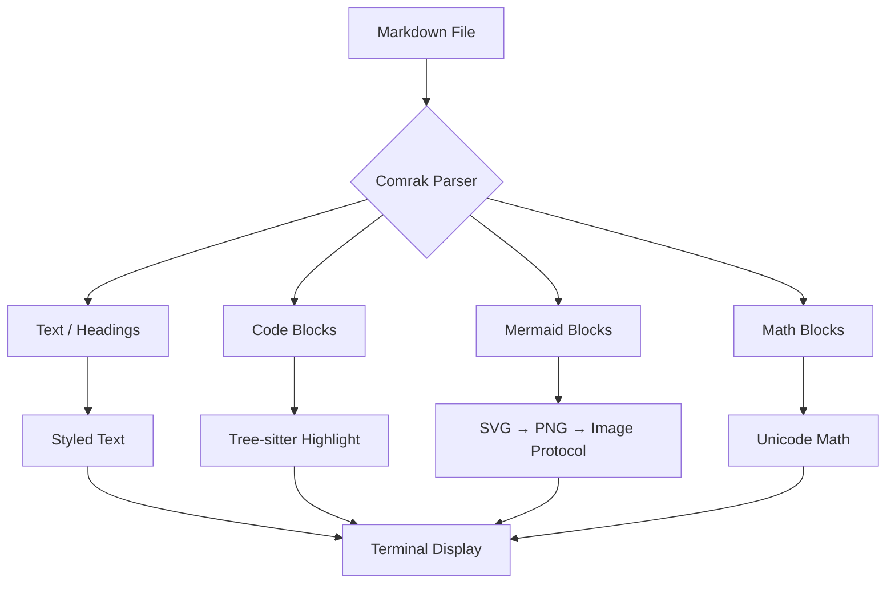
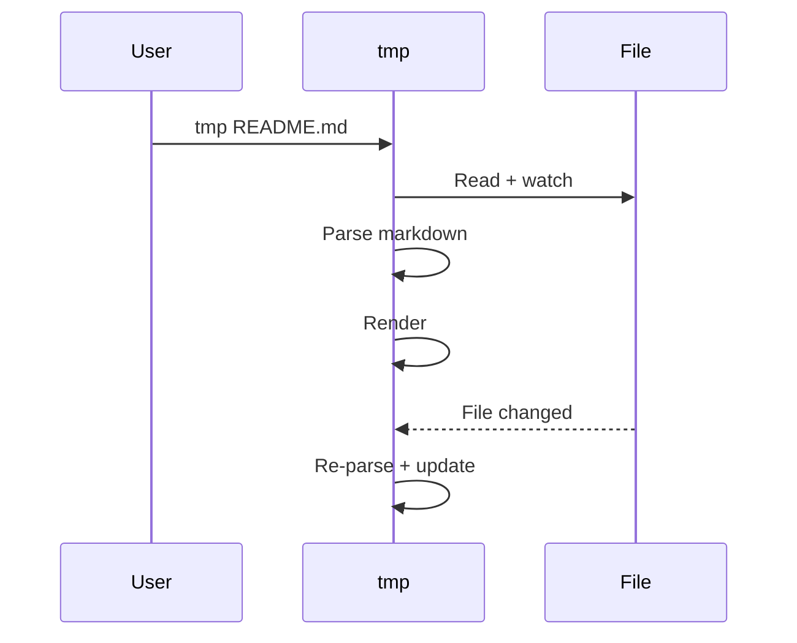
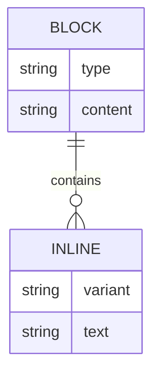

# tmp — Terminal Markdown Preview

Preview markdown files in your terminal with full rendering: headings, links, tables, syntax-highlighted code blocks, **Mermaid diagrams**, and **LaTeX math equations**.

Built with Rust. Pure terminal. No browser needed.

## Install

```bash
cargo install --path .
```

## Usage

```bash
tmp README.md             # auto-detects terminal, live reload
tmp README.md --no-watch  # no live reload
tmp README.md --tui       # force TUI mode
tmp README.md --cat       # force cat mode
```

**Auto mode detection:** Kitty/WezTerm/Ghostty get TUI mode (interactive scroll). iTerm2/Warp/others get cat mode (native scroll). Both render pixel-perfect Mermaid diagrams.

### TUI mode (Kitty/WezTerm/Ghostty)

| Key | Action |
|-----|--------|
| `q` / `Esc` | Quit |
| `↑` `↓` / Mouse wheel | Scroll |

### Cat mode (iTerm2/Warp/others)

Output to stdout with ANSI styling + OSC 1337 inline images. Scroll with your terminal's native scrollback. `Ctrl+C` to quit.

## What it renders

### Headings

# H1 Heading
## H2 Heading
### H3 Heading
#### H4 Heading

### Text formatting

**Bold**, *italic*, ~~strikethrough~~, `inline code`, and [hyperlinks](https://github.com).

### Code blocks with syntax highlighting

15 languages via tree-sitter: Rust, Python, TypeScript, JavaScript, Go, C, C++, Java, Bash, JSON, YAML, CSS, HTML, TOML.

```rust
fn main() {
    let greeting = "Hello from tmp!";
    println!("{greeting}");

    let numbers: Vec<i32> = (1..=10).filter(|n| n % 2 == 0).collect();
    for n in &numbers {
        println!("{n}");
    }
}
```

```python
from dataclasses import dataclass

@dataclass
class Point:
    x: float
    y: float

    def distance(self, other: "Point") -> float:
        return ((self.x - other.x) ** 2 + (self.y - other.y) ** 2) ** 0.5

origin = Point(0, 0)
target = Point(3, 4)
print(f"Distance: {origin.distance(target)}")
```

```typescript
interface Config {
  host: string;
  port: number;
  debug?: boolean;
}

async function startServer(config: Config): Promise<void> {
  const { host, port } = config;
  console.log(`Listening on ${host}:${port}`);
}
```

### Tables

| Crate | Purpose | Pure Rust |
|-------|---------|-----------|
| comrak | GFM markdown parser | Yes |
| mermaid-rs-renderer | Mermaid to SVG | Yes |
| resvg | SVG rasterization | Yes |
| superlighttui | TUI framework | Yes |

### Math equations

Inline math: $E = mc^2$, $\alpha + \beta = \gamma$

Display math:

$$
\int_{-\infty}^{\infty} e^{-x^2} dx = \sqrt{\pi}
$$

$$
\sum_{i=1}^{n} i^2 = \frac{n(n+1)(2n+1)}{6}
$$

$$
\nabla \times \mathbf{E} = -\frac{\partial \mathbf{B}}{\partial t}
$$

### Mermaid diagrams

Pixel-perfect on all terminals. TUI mode uses Kitty graphics protocol. Cat mode uses iTerm2 inline images (OSC 1337).







### Blockquotes

> The best way to predict the future is to invent it.
> — Alan Kay

### Lists

- Live reload on file save
- Parallel mermaid rendering with caching
- Responsive layout (adapts to terminal width)
- Auto terminal detection (TUI vs Cat mode)
- Syntax highlighting for 15 languages

---

## How it works

```
src/
├── main.rs       — CLI, mode detection, TUI/cat dispatch, file watcher
├── catmode.rs    — Cat mode: ANSI styled stdout + OSC 1337 images
├── markdown.rs   — Comrak AST → Block/Inline types
└── render.rs     — TUI mode: SLT rendering, Kitty images, math unicode
```

### Terminal support

| Terminal | Mode | Mermaid | Scroll |
|----------|------|---------|--------|
| Kitty | TUI | Pixel-perfect (Kitty protocol) | Interactive |
| WezTerm | TUI | Pixel-perfect (Kitty protocol) | Interactive |
| Ghostty | TUI | Pixel-perfect (Kitty protocol) | Interactive |
| iTerm2 | Cat | Pixel-perfect (OSC 1337) | Native |
| Warp | Cat | Pixel-perfect (OSC 1337) | Native |
| Other | Cat | Not displayed | Native |

### Performance

- Mermaid diagrams render in parallel background threads
- Results cached by source hash (instant on live reload if unchanged)
- Font database loaded once (LazyLock)
- Kitty images cached by content hash (zero I/O after first frame, zlib compressed)

## Known limitations

- **Math** uses Unicode approximation — complex nested expressions may not render perfectly
- **Mermaid** quality depends on `mermaid-rs-renderer` (0.2.x) — some diagram types have minor rendering quirks
- **Cat mode** re-renders the entire document on file change (no incremental update)

## License

MIT
