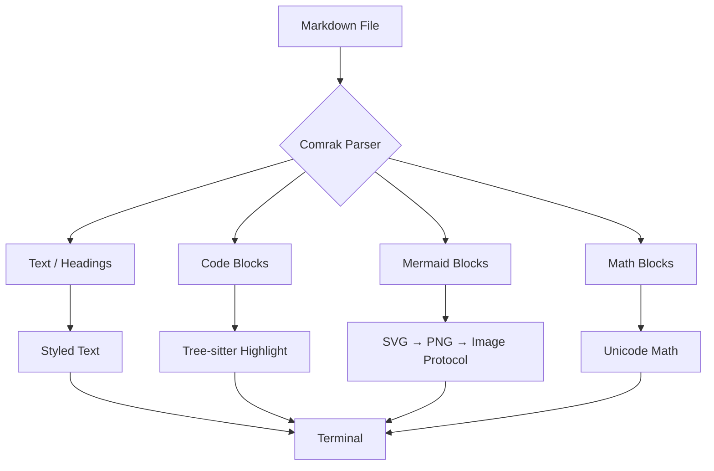
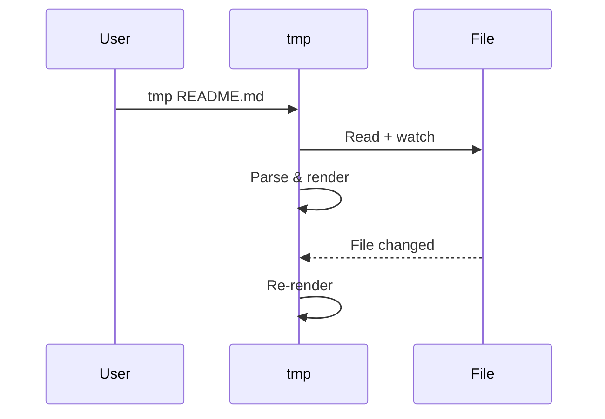

<div align="center">

# tmp

**Terminal Markdown Preview**

Preview markdown in your terminal — with Mermaid diagrams, math, and syntax highlighting.

[](https://crates.io/crates/tmdp)
[](https://github.com/subinium/terminal-markdown-preview/actions/workflows/ci.yml)
[](LICENSE)

Built with Rust. Pure terminal. No browser.

</div>

---

## Install

```bash
cargo install tmdp
```

## Usage

```bash
tmp README.md
```

That's it. Auto-detects your terminal and picks the best rendering mode.

| Flag | Effect |
|------|--------|
| *(none)* | Auto-detect terminal, live reload on |
| `--no-watch` | Disable live reload |
| `--tui` | Force TUI mode |
| `--cat` | Force cat mode |

---

## Features

### Dual rendering modes

| Terminal | Mode | Images | Scroll |
|----------|------|--------|--------|
| Kitty | TUI | Pixel-perfect (Kitty protocol) | Interactive (`↑↓` / mouse) |
| WezTerm | TUI | Pixel-perfect (Kitty protocol) | Interactive |
| Ghostty | TUI | Pixel-perfect (Kitty protocol) | Interactive |
| iTerm2 | Cat | Pixel-perfect (OSC 1337) | Native scrollback |
| Warp | Cat | Pixel-perfect (OSC 1337) | Native scrollback |

### Syntax highlighting

15 languages via tree-sitter:

```rust
fn main() {
    let numbers: Vec<i32> = (1..=10).filter(|n| n % 2 == 0).collect();
    for n in &numbers {
        println!("{n}");
    }
}
```

```python
@dataclass
class Point:
    x: float
    y: float

    def distance(self, other: "Point") -> float:
        return ((self.x - other.x) ** 2 + (self.y - other.y) ** 2) ** 0.5
```

```typescript
async function fetchUser(id: string): Promise<User> {
  const res = await fetch(`/api/users/${id}`);
  return res.json();
}
```

Supported: Rust, Python, TypeScript, JavaScript, Go, C, C++, Java, Bash, JSON, YAML, CSS, HTML, TOML.

### Mermaid diagrams

Rendered pixel-perfect via pure Rust (`mermaid-rs-renderer` + `resvg`). No Node.js required.





### Math equations

LaTeX to Unicode symbol conversion:

Inline: $E = mc^2$, $\alpha + \beta = \gamma$

$$
\int_{-\infty}^{\infty} e^{-x^2} dx = \sqrt{\pi}
$$

$$
\sum_{i=1}^{n} i^2 = \frac{n(n+1)(2n+1)}{6}
$$

### Tables

| Crate | Purpose | Pure Rust |
|-------|---------|-----------|
| comrak | GFM markdown parser | Yes |
| mermaid-rs-renderer | Mermaid to SVG | Yes |
| resvg | SVG rasterization | Yes |
| superlighttui | TUI framework | Yes |

### And more

- **Headings** with `#` prefix and visual hierarchy
- **Bold**, *italic*, ~~strikethrough~~, `inline code`
- [Hyperlinks](https://github.com) (OSC 8 clickable)
- **Blockquotes** with styled background
- **Lists** with bullet points
- **Horizontal rules**
- **Live reload** on file save

---

## Performance

- Mermaid diagrams render in **parallel threads**
- Results **cached by source hash** — unchanged diagrams skip rendering on reload
- Font database loaded once via `LazyLock`
- Kitty images cached by content hash — **zero I/O after first frame**
- zlib-compressed Kitty transmission (`kitty-compress`)

---

## Architecture

```
src/
├── main.rs       — CLI, terminal detection, TUI/cat dispatch
├── catmode.rs    — Cat mode: ANSI stdout + OSC 1337 images
├── markdown.rs   — Comrak GFM AST → Block/Inline types
└── render.rs     — TUI mode: SLT rendering, Kitty images, math
```

---

## Known limitations

- **Math**: Unicode approximation — complex nested expressions may not render perfectly
- **Mermaid**: depends on `mermaid-rs-renderer` 0.2.x — some diagram types have minor quirks
- **Cat mode**: re-renders entire document on file change

## License

MIT
